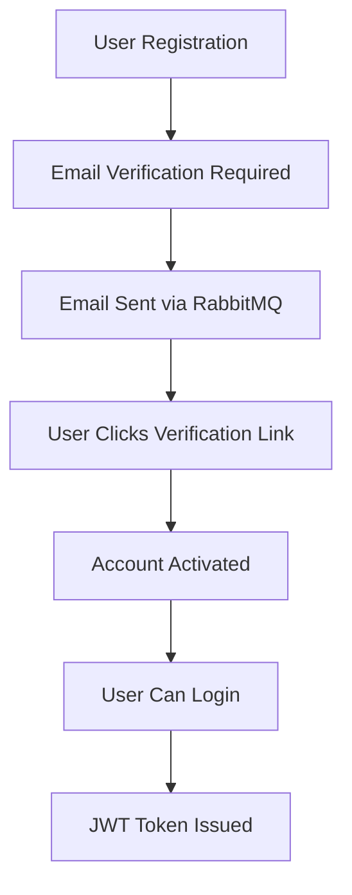
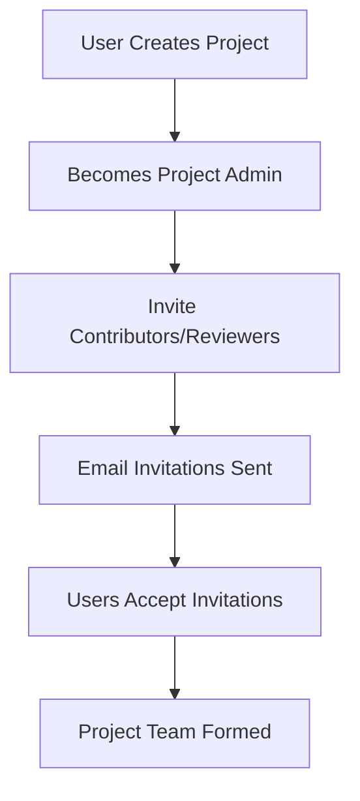
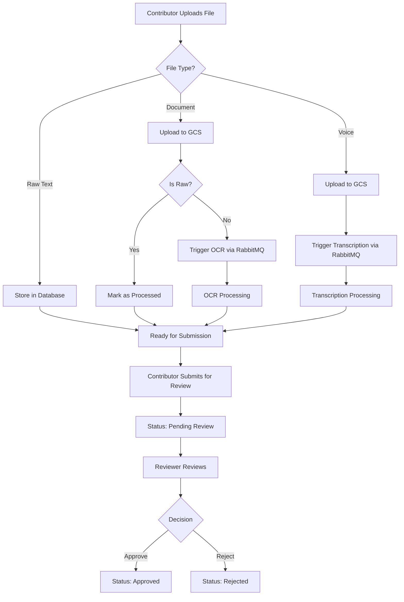
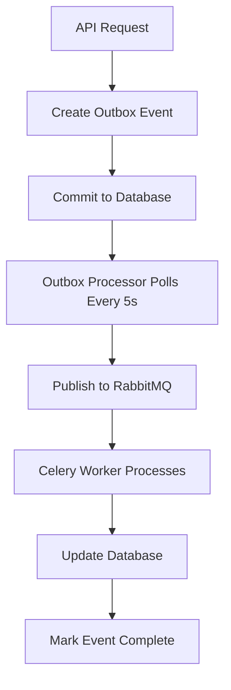

# Alta Data Backend

A comprehensive FastAPI-based backend for the Alta Data platform, designed for collection, annotation, and labeling of text and audio data with robust role-based access control, background processing, and analytics capabilities.

## 🏗️ Architecture Overview

- **Framework**: FastAPI (async-first)
- **Database**: PostgreSQL with SQLAlchemy 2.0 + Alembic migrations
- **Authentication**: JWT with email verification
- **Message Queue**: RabbitMQ for reliable background processing
- **Cache**: Redis for rate limiting, sessions, and Celery result backend
- **Object Storage**: Google Cloud Storage (GCS)
- **Background Processing**: Celery workers with outbox pattern
- **External AI Services**: Google Document AI (OCR), Google Speech-to-Text
- **Logging**: Structlog with JSON formatting and request correlation
- **Email**: SMTP for transactional emails

## 🔄 Project Flow & Workflow

### **1. User Registration & Authentication**



### **2. Project Creation & Management**



### **3. Data Upload & Processing Workflow**



### **4. Background Processing with Outbox Pattern**



## 👥 User Roles & Permissions

### **Project Admin (Owner)**
- ✅ Create and manage projects
- ✅ Invite users as contributors or reviewers
- ✅ Upload and manage all data types
- ✅ Access review queue and approve/reject submissions
- ✅ Modify project settings
- ✅ Delete projects

### **Contributors**
- ✅ Upload files (documents, voice samples)
- ✅ Create raw text entries (manual data entry)
- ✅ CRUD operations on their own draft data
- ✅ Submit data for review
- ✅ Mass submission of multiple items
- ❌ Cannot see other contributors' draft data
- ❌ Cannot delete submitted data
- ❌ Cannot access review queue
- ❌ Cannot modify project settings

### **Reviewers**
- ✅ Access review queue for assigned projects
- ✅ Approve, reject, or provide feedback on submissions
- ✅ Read-only access to all submitted data
- ❌ Cannot upload data
- ❌ Cannot modify project settings
- ❌ Cannot access draft data from contributors

## 📊 API Endpoints & Usage

### **Authentication APIs**

#### **User Registration**
```http
POST /api/auth/register
Content-Type: application/json

{
  "email": "user@example.com",
  "password": "SecurePass123!"
}

Response:
{
  "id": "user-uuid",
  "email": "user@example.com",
  "is_verified": false,
  "global_role": "user"
}
```

#### **User Login**
```http
POST /api/auth/login
Content-Type: application/json

{
  "email": "user@example.com",
  "password": "SecurePass123!"
}

Response:
{
  "access_token": "jwt-token-here"
}
```

#### **Email Verification**
```http
GET /api/auth/verify-email?token=verification-token

Response:
{
  "message": "Email verified successfully"
}
```

### **Project Management APIs**

#### **Create Project**
```http
POST /api/projects
Authorization: Bearer jwt-token
Content-Type: application/json

{
  "name": "My Research Project",
  "description": "Project for collecting research data"
}

Response:
{
  "id": "project-uuid",
  "name": "My Research Project",
  "description": "Project for collecting research data",
  "created_by_id": "user-uuid"
}
```

#### **Invite User to Project**
```http
POST /api/projects/{project_id}/invite
Authorization: Bearer jwt-token
Content-Type: application/json

{
  "email": "contributor@example.com",
  "role": "contributor"
}

Response:
{
  "invited": true,
  "token": "invitation-token"
}
```

#### **Accept Project Invitation**
```http
POST /api/projects/invitations/{token}/accept
Authorization: Bearer jwt-token

Response:
{
  "message": "Invitation accepted successfully"
}
```

### **Data Upload APIs**

#### **Upload Document**
```http
POST /api/documents?project_id={project_id}&is_raw=false
Authorization: Bearer jwt-token
Content-Type: multipart/form-data

Body: file=document.pdf

Response:
{
  "id": "document-uuid",
  "gcs_uri": "gs://bucket/path/document.pdf",
  "status": "draft",
  "is_raw": false,
  "processed": false
}
```

#### **Upload Voice Sample**
```http
POST /api/voice?project_id={project_id}
Authorization: Bearer jwt-token
Content-Type: multipart/form-data

Body: file=audio.wav

Response:
{
  "id": "voice-uuid",
  "gcs_uri": "gs://bucket/path/audio.wav",
  "status": "draft",
  "processed": false
}
```

#### **Create Raw Text Entry**
```http
POST /api/raw-text
Authorization: Bearer jwt-token
Content-Type: application/json

{
  "project_id": "project-uuid",
  "title": "Manual Data Entry",
  "content": "This is manually entered text content",
  "domain": "research",
  "tags": ["important", "draft"]
}

Response:
{
  "id": "text-uuid",
  "title": "Manual Data Entry",
  "status": "draft",
  "created_at": "2024-01-15T10:30:00Z"
}
```

### **Draft Management APIs**

#### **Get My Drafts**
```http
GET /api/my-drafts?project_id={project_id}
Authorization: Bearer jwt-token

Response:
{
  "documents": [
    {
      "id": "doc-uuid",
      "filename": "document.pdf",
      "domain": "research",
      "is_raw": false,
      "processed": true,
      "created_at": "2024-01-15T10:30:00Z"
    }
  ],
  "voice_samples": [
    {
      "id": "voice-uuid",
      "filename": "audio.wav",
      "language": "en",
      "processed": true,
      "created_at": "2024-01-15T10:30:00Z"
    }
  ],
  "raw_texts": [
    {
      "id": "text-uuid",
      "title": "Manual Entry",
      "domain": "research",
      "created_at": "2024-01-15T10:30:00Z"
    }
  ]
}
```

#### **Update Document**
```http
PUT /api/documents/{document_id}
Authorization: Bearer jwt-token
Content-Type: application/json

{
  "domain": "updated-domain",
  "tags": ["updated", "tags"]
}

Response:
{
  "id": "document-uuid",
  "status": "updated"
}
```

#### **Delete Document (Draft Only)**
```http
DELETE /api/documents/{document_id}
Authorization: Bearer jwt-token

Response:
{
  "id": "document-uuid",
  "status": "deleted"
}
```

### **Mass Submission API**

#### **Submit Multiple Items for Review**
```http
POST /api/submit
Authorization: Bearer jwt-token
Content-Type: application/json

{
  "document_ids": ["doc-uuid-1", "doc-uuid-2"],
  "voice_sample_ids": ["voice-uuid-1"],
  "raw_text_ids": ["text-uuid-1", "text-uuid-2"]
}

Response:
{
  "submitted_count": 5,
  "submitted_items": [
    {"type": "document", "id": "doc-uuid-1"},
    {"type": "document", "id": "doc-uuid-2"},
    {"type": "voice_sample", "id": "voice-uuid-1"},
    {"type": "raw_text", "id": "text-uuid-1"},
    {"type": "raw_text", "id": "text-uuid-2"}
  ]
}
```

### **Processing APIs**

#### **Manual OCR Trigger**
```http
POST /api/processing/ocr?document_id={document_id}
Authorization: Bearer jwt-token

Response:
{
  "message": "OCR processing started",
  "document_id": "document-uuid",
  "status": "processing"
}
```

#### **Manual Transcription Trigger**
```http
POST /api/processing/transcribe?voice_sample_id={voice_sample_id}
Authorization: Bearer jwt-token

Response:
{
  "message": "Transcription processing started",
  "voice_sample_id": "voice-uuid",
  "status": "processing"
}
```

#### **Batch OCR Processing**
```http
POST /api/processing/batch-ocr?document_ids=["doc1","doc2","doc3"]
Authorization: Bearer jwt-token

Response:
{
  "processed_count": 2,
  "skipped_count": 1,
  "processed_documents": ["doc1", "doc2"],
  "skipped_documents": [
    {"id": "doc3", "reason": "Already processed"}
  ]
}
```

#### **Check Processing Status**
```http
GET /api/processing/status/{item_id}?item_type=document
Authorization: Bearer jwt-token

Response:
{
  "id": "document-uuid",
  "type": "document",
  "processed": true,
  "status": "draft",
  "has_content": true
}
```

### **Review APIs**

#### **Get Review Queue**
```http
GET /api/review?project_id={project_id}
Authorization: Bearer jwt-token

Response:
[
  {
    "id": "doc-uuid",
    "type": "document",
    "title": "document.pdf",
    "status": "pending_review",
    "submitted_at": "2024-01-15T10:30:00Z",
    "uploaded_by_id": "user-uuid"
  },
  {
    "id": "voice-uuid",
    "type": "voice_sample",
    "title": "audio.wav",
    "status": "pending_review",
    "submitted_at": "2024-01-15T10:30:00Z",
    "uploaded_by_id": "user-uuid"
  },
  {
    "id": "text-uuid",
    "type": "raw_text",
    "title": "Manual Entry",
    "status": "pending_review",
    "submitted_at": "2024-01-15T10:30:00Z",
    "created_by_id": "user-uuid"
  }
]
```

#### **Review Decision**
```http
PATCH /api/review/{item_id}?item_type=document
Authorization: Bearer jwt-token
Content-Type: application/json

{
  "decision": "approve",
  "feedback": "Good quality, approved for publication"
}

Response:
{
  "id": "document-uuid",
  "type": "document",
  "status": "approved",
  "reviewed_by": "reviewer-uuid",
  "feedback": "Good quality, approved for publication"
}
```

### **Analytics APIs**

#### **Project Analytics**
```http
GET /api/analytics/summary?timeframe=7d&project_id={project_id}
Authorization: Bearer jwt-token

Response:
{
  "documentCounts": {
    "approved": 45,
    "pending_review": 12,
    "rejected": 3
  },
  "contributionDaily": [
    {"day": "2024-01-15", "count": 8},
    {"day": "2024-01-16", "count": 12}
  ]
}
```

#### **User Analytics**
```http
GET /api/analytics/user/{user_id}?timeframe=30d
Authorization: Bearer jwt-token

Response:
{
  "totalContributions": 25,
  "contributionDaily": [
    {"day": "2024-01-15", "count": 3},
    {"day": "2024-01-16", "count": 5}
  ],
  "approvalRate": 0.85
}
```

## 🔧 Background Workers & Processing

### **Outbox Processor**
- **Polling Frequency**: Every 5 seconds
- **Batch Size**: Up to 100 events per batch
- **Retry Logic**: Up to 3 retries with 60-second delay
- **Event Types**: OCR, transcription, email sending

### **Celery Workers**
- **OCR Worker**: Processes documents with Google Document AI
- **Transcription Worker**: Processes audio with Google Speech-to-Text
- **Email Worker**: Sends transactional emails
- **Queue Management**: Separate queues for different task types

### **Processing Flow**
1. **API Request** → Create outbox event in database
2. **Outbox Processor** → Polls every 5 seconds for pending events
3. **RabbitMQ** → Publishes events to appropriate Celery queues
4. **Celery Workers** → Process tasks and update database
5. **Status Update** → Mark events as completed or failed

## 🚀 Quick Start

### **Prerequisites**
- Python 3.11+
- PostgreSQL 15+
- Redis 7+
- RabbitMQ 3.12+
- Google Cloud Storage bucket
- Google Cloud credentials for Document AI and Speech-to-Text

### **Installation**

1. **Clone and setup environment:**
```bash
cd alta_data_backend
python -m venv .venv
source .venv/bin/activate  # On Windows: .venv\Scripts\activate
pip install -r requirements.txt
```

2. **Environment configuration:**
Copy `env.example` to `.env` and configure:
```bash
cp env.example .env
# Edit .env with your configuration
```

3. **Start with Docker Compose:**
```bash
# Start all services
./start.sh

# Or manually
docker-compose up --build -d
```

4. **Run migrations:**
```bash
docker-compose exec api alembic upgrade head
```

### **Access Points**
- **API**: http://localhost:8000
- **API Documentation**: http://localhost:8000/docs
- **RabbitMQ Management**: http://localhost:15672 (guest/guest)
- **Flower (Celery Monitor)**: http://localhost:5555

## 📊 Data Models

### **Document Model**
```python
{
  "id": "uuid",
  "project_id": "uuid",
  "uploaded_by_id": "uuid",
  "original_filename": "string",
  "gcs_uri": "string",
  "ocr_text": "string | null",
  "status": "draft | pending_review | approved | rejected",
  "domain": "string | null",
  "submitted_at": "datetime | null",
  "reviewed_by_id": "uuid | null",
  "feedback": "string | null",
  "is_raw": "boolean",
  "processed": "boolean",
  "tags": "json | null",
  "metadata": "json | null"
}
```

### **Voice Sample Model**
```python
{
  "id": "uuid",
  "project_id": "uuid",
  "uploaded_by_id": "uuid",
  "original_filename": "string",
  "gcs_uri": "string",
  "transcription_text": "string | null",
  "status": "draft | pending_review | approved | rejected",
  "duration_seconds": "integer | null",
  "submitted_at": "datetime | null",
  "reviewed_by_id": "uuid | null",
  "feedback": "string | null",
  "processed": "boolean",
  "language": "string | null",
  "tags": "json | null",
  "metadata": "json | null"
}
```

### **Raw Text Model**
```python
{
  "id": "uuid",
  "project_id": "uuid",
  "created_by_id": "uuid",
  "title": "string",
  "content": "string",
  "status": "draft | pending_review | approved | rejected",
  "domain": "string | null",
  "submitted_at": "datetime | null",
  "reviewed_by_id": "uuid | null",
  "feedback": "string | null",
  "tags": "json | null",
  "metadata": "json | null"
}
```

## 🔒 Security Features

- **JWT Authentication** with email verification
- **Role-based access control** (RBAC)
- **Rate limiting** with Redis
- **Input validation** with Pydantic
- **Request correlation** for tracing
- **Audit logging** for all operations
- **CORS protection** with configurable origins
- **Security headers** middleware
- **File upload validation** (type, size, content)

## 📈 Monitoring & Observability

- **Structured logging** with JSON format
- **Request correlation IDs** for tracing
- **Health check endpoints** for all services
- **Audit trail** for all user actions
- **Performance metrics** via Flower
- **Error tracking** with detailed context

## 🎯 Key Features

1. **✅ Complete Role-Based Access Control**
2. **✅ Multi-format Data Support** (Documents, Voice, Raw Text)
3. **✅ Background Processing** with reliable message delivery
4. **✅ Draft Management** with ownership validation
5. **✅ Mass Operations** for efficient bulk processing
6. **✅ Review Workflow** with unified queue
7. **✅ File Management** with GCS integration
8. **✅ Processing Control** (automatic and manual)
9. **✅ Analytics & Reporting** with multiple timeframes
10. **✅ Production-Ready** with comprehensive error handling

## 📄 License

[Add your license information here]

## 🆘 Support

For support and questions:
- Create an issue in the repository
- Contact the development team
- Check the API documentation at `/docs`

---
